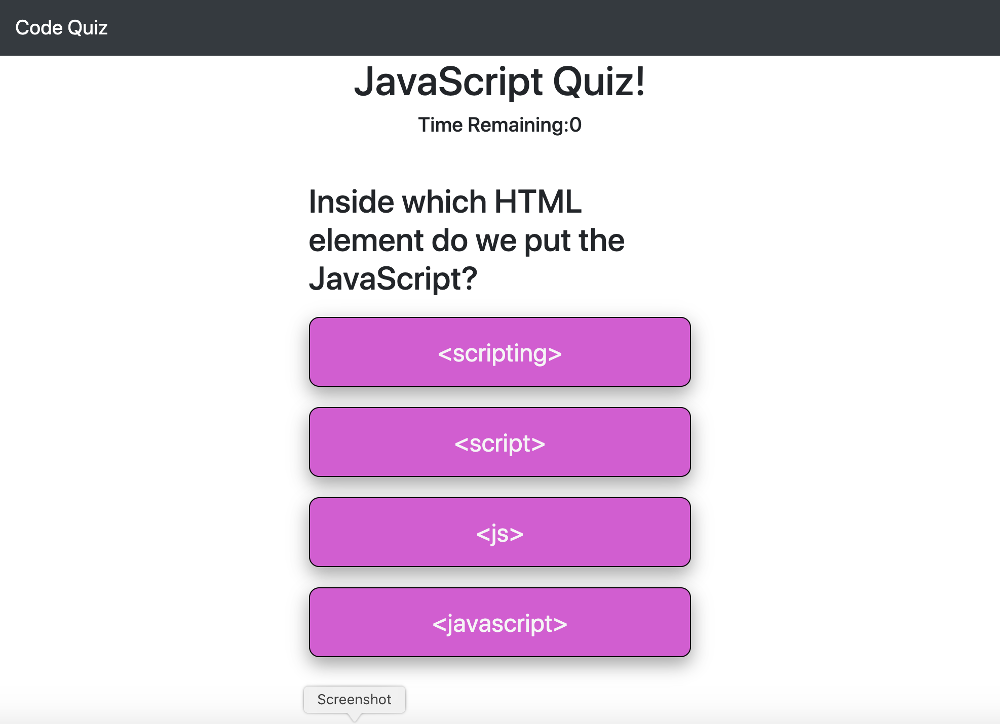

# code-quiz

This website gives the user a JavaScript coding quiz
WHEN the user clicks the start button
THEN a timer starts and the user is presented with a question
WHEN the user answers a question
THEN the user is presented with another question
WHEN the user answers a question incorrectly
THEN time is subtracted from the clock
WHEN all questions are answered or the timer reaches 0
THEN the game is over
WHEN the game is over
THEN the user can save their initials and score

